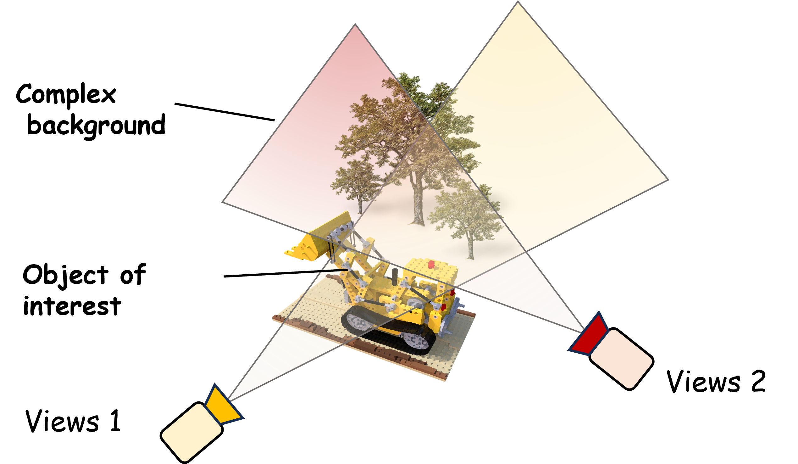
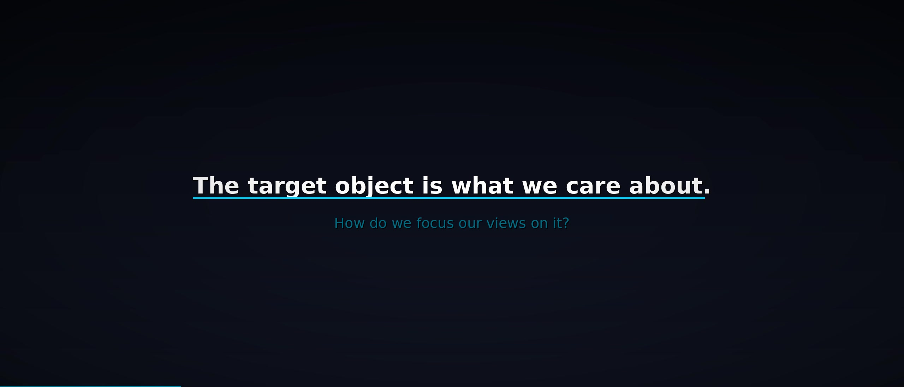
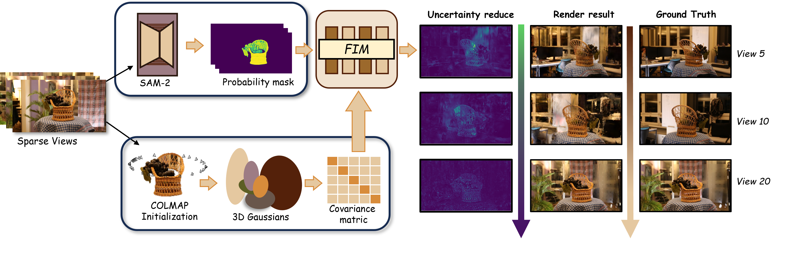
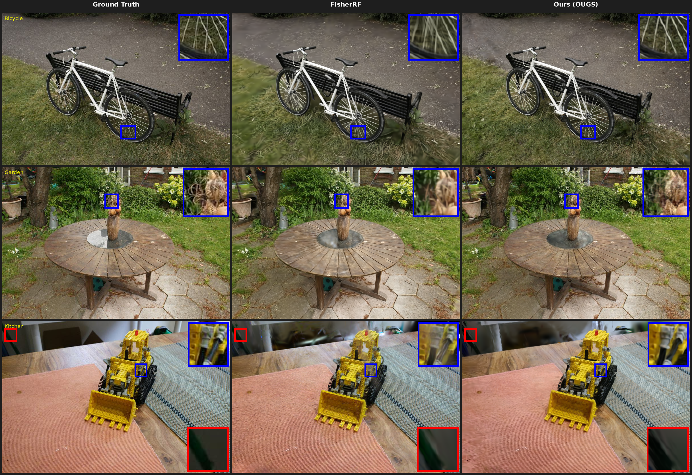
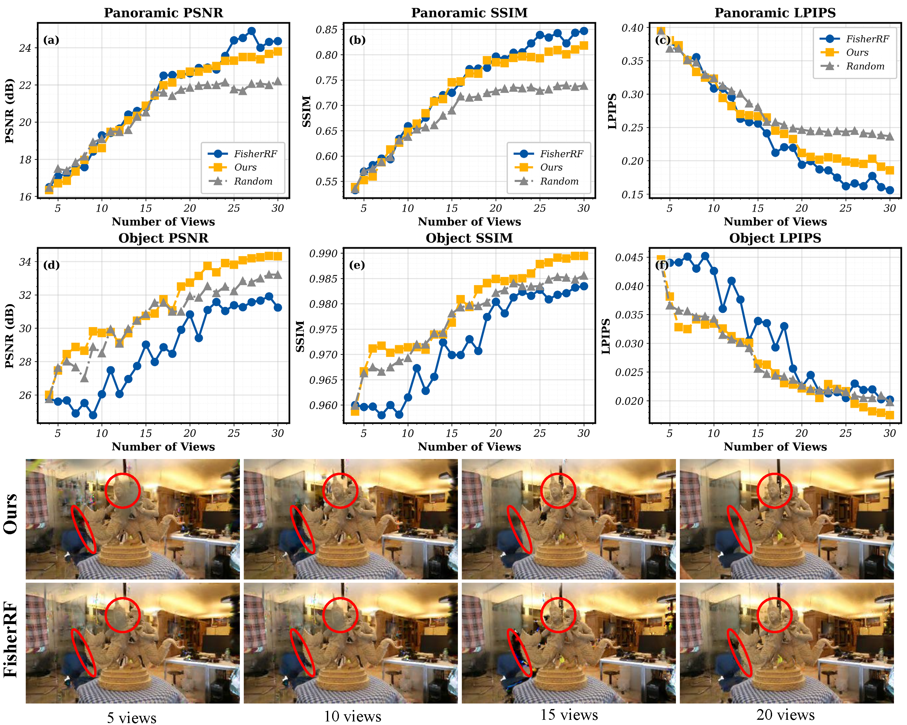

<div align="center">

# OUGS

### Active View Selection via Object-aware Uncertainty Estimation in 3DGS

**Haiyi Li**<sup>1</sup> · **Qi Chen**<sup>1</sup> · **Denis Kalkofen**<sup>2</sup> · **Hsiang-Ting Chen**<sup>1</sup>

<sub><sup>1</sup> The University of Adelaide &nbsp;·&nbsp; <sup>2</sup> Graz University of Technology</sub>

<br/>

[](https://diglib.eg.org/handle/10.1111/cgf70363)
[](https://doi.org/10.1111/cgf.70363)
[](https://onlinelibrary.wiley.com/journal/14678659)
[](LICENSE.md)

[](https://www.python.org/)
[](https://pytorch.org/)
[](https://developer.nvidia.com/cuda-toolkit)
[](https://github.com/Gatsby0916/3dgs_uncertainty/stargazers)

<br/>

📄 [**Paper**](https://diglib.eg.org/handle/10.1111/cgf70363) &nbsp;·&nbsp;
🔗 [**DOI**](https://doi.org/10.1111/cgf.70363) &nbsp;·&nbsp;
🎬 [**Video**](assets/ougs_fast_forward.mp4) &nbsp;·&nbsp;
📑 [**BibTeX**](#-citation)

<br/>



</div>

---

> ✨ **TL;DR** &nbsp;Scene-level uncertainty in 3DGS is dominated by background clutter, which biases next-best-view (NBV) selection *away* from the object of interest. **OUGS** derives uncertainty directly from each Gaussian's explicit physical parameters via a Jacobian-propagated pixel covariance, then modulates it with a semantic foreground mask so NBV scoring focuses on the object.

<br/>

## 🎬 Fast-Forward Video

<div align="center">

<a href="https://github.com/Gatsby0916/3dgs_uncertainty/raw/main/assets/ougs_fast_forward.mp4">
  
</a>

<sub>▶️ Click to play the 40-second EG2026 fast-forward video &nbsp;·&nbsp; <a href="assets/ougs_fast_forward.mp4">download MP4</a></sub>

</div>

<br/>

## 🌟 Highlights

- 🎯 **Object-centric NBV for 3DGS** — the first method to explicitly tackle the background-bias problem in active 3DGS reconstruction.
- 🧮 **Physically-grounded uncertainty** — derived from each Gaussian's explicit parameters (position, scale, rotation, opacity, SH colour) and propagated to pixels through the rendering Jacobian.
- ⚡ **Efficient online Fisher** — a diagonal Fisher Information Matrix updated by an EMA of squared gradients on a decaying schedule, folded into the standard 3DGS training loop with negligible overhead.
- 🧪 **Strong empirical gains** — substantial object-level improvements over ActiveNeRF, FisherRF, Bayes' Rays and GauSS-MI on Mip-NeRF 360, Light-Field, and Tanks-and-Temples scenes.

<br/>

## 🧠 Method

<div align="center">

</div>

The diagonal parameter covariance is propagated through the rendering Jacobian $J_u$ into a per-pixel colour covariance, and modulated by the (squared) foreground probability $M_k(u)$:

$$
\Sigma_{C,k}(u) \;=\; M_k(u)^2 \cdot J_u \, \bigl(\mathrm{diag}(I_t) + \lambda I\bigr)^{-1} \, J_u^{\top}
$$

Aggregating this variance over the object mask scores each candidate view; the highest-scoring unobserved view is added to the training set.

<br/>

## ⚙️ Installation

```bash
conda create -n 3dgs python=3.10
conda activate 3dgs

git submodule update --init --recursive
pip install -r requirements.txt
pip install -e submodules/diff-gaussian-rasterization
pip install -e submodules/simple-knn
pip install -e submodules/fused-ssim          # optional, faster SSIM
```

> 💡 Environment is identical to the upstream 3DGS codebase — any working 3DGS install runs OUGS as a drop-in replacement.

<br/>

## 🚀 Usage

### 🏋️ Train (with Fisher-EMA covariance)

```bash
python train.py -s <path/to/scene> -m <output_dir>
```

The checkpoint contains the usual 3DGS state plus per-parameter Fisher / covariance buffers.

### 🎨 Render with uncertainty

```bash
python render.py -m <output_dir> --uncertainty_mode --patch_size 8
```

Produces, under `<output_dir>/{train,test}/ours_<iter>/`:

| Folder | Contents |
| :--- | :--- |
| `renders/` | RGB predictions |
| `uncertainty/` | Viridis uncertainty heatmaps |
| `uncertainty_npz/` | Raw per-pixel variance (used by the NBV scorer) |
| `depth/` | Depth maps |

### 🎯 Active view selection pipeline

End-to-end NBV loop: initial-view picking → train segment → render uncertainty → score → append best view.

```bash
python pipeline/unified_pipeline.py pipeline/pipeline_config.yml
```

Tunable knobs in [`pipeline/pipeline_config.yml`](pipeline/pipeline_config.yml):

| Key | Meaning |
| :--- | :--- |
| `nbv_schedule` | Iteration milestones at which a new view is added |
| `uncert_mode.patch_size` | Spatial patch size for first-pass scoring |
| `uncert_mode.thr` | Foreground-probability threshold |
| `uncert_mode.mode` | `sum` / `mean` / `max` / `pXX` aggregation |
| `train.total_iterations` | Final training budget (30k by default, FisherRF-aligned) |

A random-view baseline lives at [`pipeline/random_pipeline.py`](pipeline/random_pipeline.py).

### 📐 Evaluation

```bash
python evaluation/masked_metrics.py -m <output_dir> --split test
```

Object-masked PSNR / SSIM / LPIPS plus the AUSE uncertainty-calibration metric are implemented under [`evaluation/`](evaluation/).

<br/>

## 📊 Results

### Active view selection — qualitative comparisons

<div align="center">

<br/>
<sub>Cross-method qualitative grid on Mip-NeRF 360, Light-Field, and Tanks-and-Temples scenes. OUGS recovers crisper object geometry and texture than Random / FisherRF baselines under the same view budget.</sub>
</div>

<br/>

### Object-aware view scoring

<div align="center">

<br/>
<sub>OUGS's object-aware uncertainty (right) concentrates on the target, while scene-level baselines (left) waste budget on background clutter — leading to the qualitative gains above.</sub>
</div>

<br/>

OUGS substantially outperforms ActiveNeRF, FisherRF, Bayes' Rays and GauSS-MI at **object-level** reconstruction across Mip-NeRF 360, Light-Field, and Tanks-and-Temples. Full quantitative tables and per-scene breakdowns are in the [paper](https://doi.org/10.1111/cgf.70363).

<br/>

## 📂 Repository Layout

```
3dgs_uncertainty/
├── train.py · render.py · metrics.py     # entry points
├── gaussian_renderer/                    # Jacobian-aware renderer + Fisher utils
├── scene/                                # GaussianModel with Fisher-EMA covariance
├── pipeline/                             # NBV active-learning loop + configs
├── evaluation/                           # masked PSNR/SSIM/LPIPS + AUSE
├── preprocess/                           # mask conversion, blending, enhance
├── scripts/                              # batch shell wrappers
├── arguments/ · utils/ · lpipsPyTorch/   # supporting modules
└── submodules/                           # diff-gaussian-rasterization, simple-knn, fused-ssim
```

<br/>

## 📑 Citation

If OUGS helps your research, please cite:

```bibtex
@article{10.1111:cgf.70363,
  journal   = {Computer Graphics Forum},
  title     = {{OUGS: Active View Selection via Object-aware Uncertainty Estimation in 3DGS}},
  author    = {Li, Haiyi and Chen, Qi and Kalkofen, Denis and Chen, Hsiang-Ting},
  year      = {2026},
  publisher = {The Eurographics Association and John Wiley \& Sons Ltd.},
  ISSN      = {1467-8659},
  DOI       = {10.1111/cgf.70363}
}
```

Please also cite the original 3D Gaussian Splatting paper:

```bibtex
@inproceedings{kerbl23gaussians,
  title     = {{3D} Gaussian Splatting for Real-Time Radiance Field Rendering},
  author    = {Kerbl, Bernhard and Kopanas, Georgios and Drettakis, George},
  booktitle = {SIGGRAPH Asia},
  year      = 2023
}
```

<br/>

## 📝 License & Acknowledgments

Non-commercial research use — see [`LICENSE.md`](LICENSE.md).

This codebase extends the official [3D Gaussian Splatting](https://github.com/graphdeco-inria/gaussian-splatting) implementation. We thank the original authors.

<br/>

<div align="center">

⭐ **Found this useful? Give us a star!** ⭐

<sub>Made with ❤️ at The University of Adelaide</sub>

</div>
